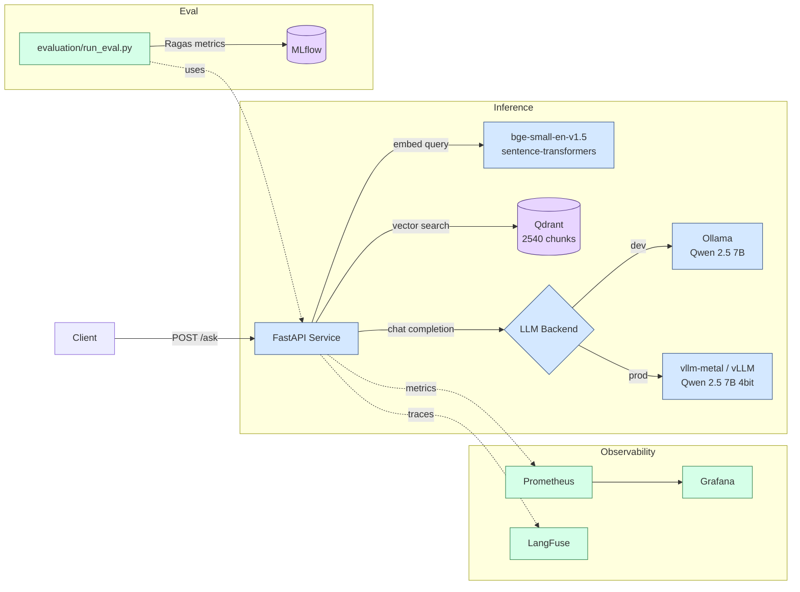

# DocsRAG

Self-hosted RAG (Retrieval-Augmented Generation) system for technical documentation Q&A.

## TL;DR

End-to-end production-grade RAG system over FastAPI documentation (153 markdown files, 2540 chunks). Built from scratch as a learning project to demonstrate modern MLOps practices for LLM systems. Highlights:

- **Evaluation-driven design.** Every retrieval/generation decision is backed by Ragas metrics on a 25-question golden dataset, tracked in MLflow.
- **Honest negative results.** Tested hybrid search and agentic RAG; both lost to plain dense retrieval on this corpus and the README explains why.
- **Switchable inference.** Same API code runs against Ollama (dev) or vLLM (prod) via a single env variable. Benchmark on M4 Max: vllm-metal **3.8× faster** than Ollama.
- **Cross-language Q&A.** Ask in Russian, get Russian answers — implemented as a thin RU↔EN translation wrapper over the English-only pipeline. No reindex required.
- **Full observability stack.** Prometheus + Grafana for system metrics, LangFuse for LLM tracing — both fully optional and additive.

## Key Findings

These are the non-obvious results from running the full eval pipeline. Each is the kind of thing you only learn by actually building and measuring:

1. **Bigger chunks beat more chunks.** Going from `chunk_size=512, top_k=10` to `chunk_size=1024, top_k=5` gave better metrics on every dimension (faithfulness +0.064, context_precision +0.072) while sending fewer tokens to the LLM. More semantic context per chunk > more chunks.

2. **BM25 hurts on semantically rich corpora.** Hybrid retrieval (dense + BM25 via RRF) underperformed pure dense by **−0.093 faithfulness**. Technical documentation about FastAPI is full of natural-language explanation; keyword overlap from BM25 added more noise than signal. A cross-encoder reranker recovered some quality but still didn't beat dense.

3. **Agentic RAG is a precision/recall trade, not a free win.** A LangGraph agent with relevance grading improved `context_precision` by +0.055 but cut `context_recall` by −0.107 — the binary grader discards borderline-relevant chunks that actually contained answers. Pick agentic when precision matters more than coverage; pick simple RAG otherwise.

4. **vLLM on Apple Silicon is real and fast.** The MLX-based `vllm-metal` server delivers OpenAI-compatible API with **3.8× faster generation** than llama.cpp-based Ollama (891ms vs 3375ms avg) on M4 Max. Same code path works for production CUDA vLLM — swap the image, set `VLLM_BASE_URL`.

5. **Cosine + normalized embeddings is non-negotiable.** Forgetting `normalize_embeddings=True` in `sentence-transformers` silently breaks retrieval quality without obvious errors. The bug doesn't surface until you measure with Ragas.

## Goals

A production-grade RAG system demonstrating modern MLOps practices:
- End-to-end RAG pipeline with hybrid retrieval and reranking
- Agentic workflow via LangGraph (query rewriting, relevance grading)
- Quality evaluation with Ragas, experiment tracking with MLflow
- Full observability: LLM tracing (LangFuse) + system metrics (Prometheus/Grafana)
- Multi-backend inference: Ollama for development, vLLM for production

## Tech Stack

| Layer | Technology |
|---|---|
| API | FastAPI + Pydantic |
| LLM | Qwen 2.5 7B Instruct via Ollama (dev) / vllm-metal MLX (prod) |
| Embeddings | BAAI/bge-small-en-v1.5 (384-dim, English, MPS on Apple Silicon) |
| Vector DB | Qdrant (cosine similarity) |
| Orchestration | LangChain + LangGraph |
| Retrieval | Dense (Qdrant) + Sparse (BM25) + Cross-encoder reranker |
| Evaluation | Ragas + MLflow |
| Observability | LangFuse, Prometheus, Grafana |
| Prod inference | vLLM (vllm-metal on Apple Silicon, vllm+CUDA in cloud) |
| Packaging | Docker Compose, uv |

## System Architecture



The API is the only stateful service. Qdrant holds chunk embeddings; MLflow holds eval runs. Ollama / vLLM are stateless inference servers swapped via `INFERENCE_BACKEND` env var. Observability is fully additive — the system runs unchanged without LangFuse keys or with Prometheus disabled.

## Quick Start

> **Platform note:** this guide was developed and tested on **Apple Silicon (MacBook M4 Max)**. Core services (Qdrant, API, MLflow) run in Docker and should work on any platform. Ollama, embeddings (MPS), and vllm-metal are macOS ARM64-specific — behaviour on other systems is not guaranteed.

### Prerequisites

| Tool | Purpose | Install |
|---|---|---|
| Docker Desktop | Qdrant, API, MLflow, Prometheus, Grafana | [docker.com](https://www.docker.com/products/docker-desktop/) |
| Python 3.12 | Local tooling (eval, indexing, benchmarks) | `brew install python@3.12` |
| uv | Fast Python package manager | `brew install uv` |
| Ollama (macOS app) | LLM inference — runs natively for Metal GPU | [ollama.com](https://ollama.com) |

### Step 1 — Clone and install

```bash
git clone <repo-url>
cd DocsRAG

# Create virtualenv and install all dependencies
make install
```

### Step 2 — Configure environment

```bash
cp .env.example .env
```

Required fields in `.env`:

```
HF_TOKEN=hf_...   # Hugging Face token (required to download the embedding model)
```

All other values can be left as-is for local development.

### Step 3 — Pull the LLM model into Ollama

```bash
# Make sure the Ollama app is running (icon in the menu bar)
ollama pull qwen2.5:7b-instruct-q4_K_M
```

### Step 4 — Start infrastructure

```bash
make up        # starts Qdrant + API + MLflow + Prometheus + Grafana
make health    # checks that everything is up
```

The first API start takes ~30–60 s — the embedding model (~130 MB) is being downloaded.

### Step 5 — Index documents (one-time, ~2 min)

```bash
make fetch-docs   # downloads 153 FastAPI docs markdown files into data/raw/
make reindex      # indexes into Qdrant (chunk_size=1024, overlap=100)
```

### Step 6 — Ask a question

```bash
make warmup                                             # loads the LLM into Ollama RAM
make ask Q='How do I define a path parameter in FastAPI?'
```

Expected response in ~3–5 s with source citations (`tutorial/path-params.md`).

### Step 7 — Observability (optional)

```bash
make grafana-ui    # http://localhost:3000 — login admin/admin, DocsRAG dashboard
make prometheus-ui # http://localhost:9090 — raw metrics
make mlflow-ui     # http://localhost:5000 — eval experiment results
```

LangFuse tracing is enabled by adding keys to `.env`:
```
LANGFUSE_PUBLIC_KEY=pk-lf-...
LANGFUSE_SECRET_KEY=sk-lf-...
LANGFUSE_BASE_URL=https://cloud.langfuse.com
```
Get keys at: [cloud.langfuse.com](https://cloud.langfuse.com) → project → Settings → API Keys.

### Step 8 — vllm-metal backend (optional, Apple Silicon only)

Faster inference via MLX (3.8× faster than Ollama on M4 Max). `vllm-metal` 0.2.0 is a plugin to upstream `vllm`, so both packages must be installed into the project venv via `make install-vllm`. They're not in `pyproject.toml` / `uv.lock`: vllm's own pyproject hard-pins CUDA-only deps (`nvidia-cudnn-frontend`, `cuda-python`, `flashinfer-python`...) that have no macOS wheels, and the manual two-phase install (CPU requirements → main build) can't be expressed in uv's universal resolver — verified experimentally.

```bash
# 1. Install vllm core + vllm-metal plugin into .venv (~5-15 min; builds vllm from source)
source .venv/bin/activate
make install-vllm

# 2. Start the server (default model: Qwen2.5-7B-Instruct-4bit; override via VLLM_MODEL in .env)
make vllm-start

# 3. Check status
make vllm-status

# 4. Switch the API to vllm
echo "INFERENCE_BACKEND=vllm" >> .env
make restart

# 5. Verify with a request
make ask Q='What is FastAPI?'
```

Versions are pinned via `VLLM_VERSION` / `VLLM_METAL_WHEEL` variables at the top of the `Makefile` — bump them explicitly when upgrading.

**Caveat:** installing `vllm` pulls a large dependency tree (torch, transformers, kernels) and overrides versions of packages also used by the RAG pipeline. After install run `make health` to confirm the API still starts. If you ever run `uv pip sync uv.lock`, vllm + metal will be removed — just re-run `make install-vllm`.

### Step 9 — Run evaluation (optional, ~15 min)

```bash
# Ollama (baseline)
make eval CONFIG=configs/chunk_1024.yaml

# vllm-metal (requires a running vllm-metal server)
INFERENCE_BACKEND=vllm uv run python evaluation/run_eval.py --config configs/chunk_1024.yaml
```

## API

The RAG API runs on `http://localhost:8000`.

### `GET /health`

```bash
make health
```

Returns Qdrant collection status, point count, and configured model names.

### `POST /ask`

```bash
make ask Q='How does dependency injection work in FastAPI?'
```

Parameters:

| Field | Type | Default | Description |
|---|---|---|---|
| `question` | string | — | Natural language question |
| `top_k` | int | 5 | Number of chunks to retrieve |
| `include_contexts` | bool | false | Include raw chunk text in response |

Response includes `answer`, `sources` (with `source_path`, `header_path`, `score`), and timing breakdown (`retrieval_ms`, `generation_ms`, `translation_ms`, `total_ms`).

### `POST /agent/ask`

Routes the question through the LangGraph agent (query rewriting + relevance grading + conditional retry). Same request/response shape as `/ask`. Use when precision matters more than recall (see Task 6 results below).

### Cross-language support

The same endpoints (`/ask` and `/agent/ask`) accept questions in **Russian** without any flag or extra parameter. The pipeline detects Cyrillic in the question, translates it to English for retrieval and generation, then translates the answer back to Russian before returning it.

```bash
make ask Q='Как определить path-параметр в FastAPI?'
```

Response shape is unchanged; `translation_ms` reports the combined RU→EN + EN→RU latency (`0` for English questions). File-path citations like `[tutorial/path-params.md]` and code blocks are preserved verbatim. Translation steps log at INFO level (`make api-logs` shows `RU→EN | in=... | out=...`).

**Backend choice matters for Russian.** On `INFERENCE_BACKEND=vllm` with the default `Qwen2.5-7B-Instruct-4bit` (MLX), the EN→RU step produces garbled Cyrillic — Latin-with-acute artefacts mid-word (e.g. `разdéлвние` instead of `разработки`). Use `Qwen2.5-14B-Instruct-4bit` for clean Russian output (set `VLLM_MODEL` in `.env`). On `INFERENCE_BACKEND=ollama` (default), the GGUF-quantized 7B handles Russian cleanly — no model swap needed. The 4bit MLX quantization of Qwen 2.5 7B has a vocabulary/sampling artefact that the larger 14B model avoids.

**Why translation, not multilingual embeddings?** The index uses `BAAI/bge-small-en-v1.5` (English-only) and was tuned on an English golden dataset (faithfulness 0.882, context_recall 0.557). Swapping to a multilingual embedder (`bge-m3`, `multilingual-e5`) requires a full reindex on a ~2 GB model and would degrade the validated English baseline. Translation is reversible, leaves the index untouched, and reuses the existing multilingual LLM (Qwen 2.5) — at a cost of two extra LLM calls per Russian query (~+1.5 s on Ollama 7B, ~+8 s on vllm-metal 7B, ~+13 s on vllm-metal 14B).

## Evaluation

Evaluation uses [Ragas](https://docs.ragas.io) metrics over a 25-question golden dataset derived from FastAPI documentation. Results are tracked in MLflow (`http://localhost:5000`).

```bash
make eval CONFIG=configs/chunk_1024.yaml   # run evaluation (dense baseline)
make mlflow-ui                             # open MLflow UI
```

**Metric reference:**
- **faithfulness** — does the answer follow from the retrieved context (no hallucination)?
- **answer_relevancy** — does the answer actually address the question?
- **context_precision** — of the retrieved chunks, how many are actually relevant?
- **context_recall** — of the chunks needed to answer, how many were retrieved?

`faithfulness` and `answer_relevancy` measure generation quality; `context_precision` and `context_recall` measure retrieval quality.

### Task 4 sweep — chunk size and top-k (dense retrieval)

| Config | chunk\_size | overlap | top\_k | faithfulness | answer\_relevancy | context\_precision | context\_recall |
|---|---|---|---|---|---|---|---|
| chunk\_256 | 256 | 25 | 5 | 0.646 | 0.767 | 0.417 | 0.353 |
| baseline | 512 | 50 | 5 | 0.757 | 0.849 | 0.506 | 0.431 |
| topk\_3 | 512 | 50 | 3 | 0.719 | 0.775 | 0.517 | 0.403 |
| topk\_10 | 512 | 50 | 10 | 0.818 | **0.892** | 0.526 | 0.517 |
| **chunk\_1024** ✓ | **1024** | **100** | **5** | **0.882** | 0.886 | **0.598** | **0.557** |

**Takeaway:** chunk size dominates top-k. Doubling chunk size (512→1024) gave a bigger metric jump than doubling top-k (5→10), and used half the chunks. Frozen baseline for all subsequent experiments: `chunk_1024`.

### Task 5 — hybrid search and reranking (chunk\_size=1024, top\_k=5)

| Strategy | faithfulness | answer\_relevancy | context\_precision | context\_recall |
|---|---|---|---|---|
| **dense** ✓ | **0.882** | 0.886 | **0.598** | **0.557** |
| hybrid (dense + BM25 → RRF) | 0.789 | 0.818 | 0.556 | 0.523 |
| hybrid\_rerank (+ cross-encoder) | 0.825 | **0.890** | 0.566 | 0.510 |

**Finding:** dense retrieval outperforms both hybrid variants on this dataset. BM25 adds keyword-match noise to semantically rich technical documentation where the dense embeddings already perform well. The cross-encoder partially recovers `answer_relevancy` and `context_precision` but cannot fully offset the RRF noise. Dense remains the production strategy.

**When hybrid would likely help instead:** corpora with many exact-match terms that embeddings struggle with — error codes, API tokens, version numbers, product SKUs, function names without surrounding prose. The FastAPI docs corpus is the opposite: prose-heavy explanations where dense semantics shine.

### Task 6 — agentic RAG (chunk\_size=1024, top\_k=5, dense retrieval)

| Strategy | faithfulness | answer\_relevancy | context\_precision | context\_recall |
|---|---|---|---|---|
| dense (baseline) | **0.882** | 0.886 | 0.598 | **0.557** |
| agentic | 0.817 | 0.813 | **0.653** | 0.450 |

**Finding:** agentic grading improves `context_precision` (+0.055) by filtering irrelevant chunks before generation, but at the cost of `context_recall` (−0.107): the binary relevance grader discards borderline-relevant chunks. `faithfulness` and `answer_relevancy` drop slightly because graded-out context sometimes contained answers. Dense remains the better end-to-end strategy; the agentic pipeline is useful when precision matters more than recall.

## Agentic RAG Graph

The `/agent/ask` endpoint runs questions through a LangGraph agent that rewrites the query, grades retrieved chunks for relevance, and retries retrieval if necessary.


**Nodes:**
- `query_rewriter` — LLM rewrites the question to improve retrieval; on retry uses different phrasing
- `retriever` — dense vector search via Qdrant
- `relevance_grader` — LLM scores each chunk as relevant/not relevant (JSON verdict)
- `generator` — generates the final answer from relevant chunks only

**Retry logic:** if fewer than 2 chunks pass grading and no retry has been attempted, the graph loops back to `query_rewriter`. Maximum 1 retry.

## Task 8 — vLLM backend + benchmark (Apple Silicon, M4 Max)

Inference backend is switchable via `INFERENCE_BACKEND=ollama|vllm` in `.env`.  
With `vllm`, the API uses `ChatOpenAI` pointing at a [vllm-metal](https://github.com/vllm-project/vllm-metal) endpoint (OpenAI-compatible, same API as production vLLM on CUDA).

**Benchmark — generation latency, 5 warm questions, top\_k=3:**

| Backend | avg gen | p50 gen | min | max |
|---|---|---|---|---|
| Ollama (Qwen2.5-7B q4\_K\_M, llama.cpp) | 3375ms | 3439ms | 2064ms | 4327ms |
| **vllm-metal (Qwen2.5-7B 4bit, MLX)** | **891ms** | **911ms** | **705ms** | **1075ms** |

**Finding:** vllm-metal is **3.8× faster** on generation latency vs Ollama on M4 Max. MLX uses Apple Silicon unified memory more efficiently than llama.cpp. On a CUDA GPU, the same code (with `vllm/vllm-openai` image) would provide similar or greater speedup.

**Quality comparison (Ragas eval, 25 samples, chunk\_size=1024, top\_k=5):**

| Metric | Ollama q4\_K\_M | vllm-metal 4bit | Δ |
|---|---|---|---|
| faithfulness | **0.882** | 0.827 | −0.055 |
| answer\_relevancy | 0.886 | **0.907** | +0.021 |
| context\_precision | 0.598 | 0.598 | ≈0 |
| context\_recall | 0.557 | 0.557 | ≈0 |

Context metrics are identical (same retrieval). Minor faithfulness/relevancy gap reflects quantization format differences (GGUF q4\_K\_M vs MLX 4bit), not a meaningful quality difference at this sample size.

To reproduce:
```bash
# 1. Install vllm-metal (macOS ARM64 only — see Step 8 in Quick Start for the
#    full install (vllm core 0.20.1 from source + plugin wheel))

# 2. Start the vllm server (plugin auto-registers as a vllm platform backend)
vllm serve mlx-community/Qwen2.5-7B-Instruct-4bit --host 127.0.0.1 --port 8001

# 3. Verify the server is up
curl http://127.0.0.1:8001/v1/models
curl http://127.0.0.1:8001/v1/chat/completions \
  -H "Content-Type: application/json" \
  -d '{"model": "mlx-community/Qwen2.5-7B-Instruct-4bit", "messages": [{"role": "user", "content": "Hi!"}], "max_tokens": 20}'

# 4. Switch the API to vllm backend
echo "INFERENCE_BACKEND=vllm" >> .env

# 5. Run benchmark (Ollama must also be running)
uv run python benchmarks/bench_backends.py

# 6. Run Ragas eval on vllm
INFERENCE_BACKEND=vllm uv run python evaluation/run_eval.py --config configs/chunk_1024.yaml
```
## Lessons Learned

Things this project taught me that aren't in any RAG tutorial:

**1. Eval-driven beats intuition-driven, every time.**  
Three different decisions in this project (chunk size, hybrid vs dense, agentic vs simple) felt obvious going in and turned out the opposite when measured. Without Ragas + MLflow I would have shipped worse versions of all three with full confidence. The evaluation harness was the single highest-leverage thing in the project.

**2. "Production-ready" means swappable.**  
The single `INFERENCE_BACKEND` env var is the difference between a one-off demo and a system you can actually deploy. The exact same RAG code runs against Ollama on a laptop or vLLM on H100s — only the URL changes. Designing for that boundary from the start (via OpenAI-compatible API) was free; retrofitting it would have been painful.

**3. Determinism is a feature.**  
`temperature=0.0` everywhere isn't paranoia — it's what makes Ragas evaluation actually reproducible across runs. Once that's broken, every "the metric improved" claim becomes "the metric improved or maybe noise."

**4. Observability has to be additive.**  
LangFuse and Prometheus were added in Task 7 with zero changes to the RAG pipeline logic. The pipeline doesn't know whether tracing is on. If observability is invasive (callbacks threading through business logic, conditional code paths for "metrics enabled"), it gets ripped out the first time it breaks something. Decouple it.

**5. Embed once, embed everywhere — but make sure it's literally the same embedder.**  
The same `EmbeddingModel` instance handles both indexing and query-time encoding. Using a different LangChain wrapper at query time (even one that "should" be equivalent) silently degrades retrieval because of subtle differences in pooling/normalization. The bug doesn't crash, it just makes things slightly worse. Eval would catch it; trust wouldn't.

**6. Honest negative results > impressive demos.**  
Showing that hybrid+rerank lost to dense, and that agentic RAG sacrificed recall for precision, is more interesting than claiming everything got better. Anyone can build a stack of trendy components; understanding the trade-offs is the actual MLOps skill.

## Production Considerations

What I'd do differently if this were a real production system:

**Inference scaling**  
- Move vLLM to a CUDA host with `vllm/vllm-openai` Docker image; same `INFERENCE_BACKEND=vllm` codepath works without changes.
- Front it with a load balancer; vLLM supports continuous batching and multiple replicas.
- Add request queueing with backpressure — `/ask` should fail fast under overload, not pile up.

**Vector DB**  
- Qdrant in HA mode with replicas; the current single-node setup loses data on disk failure.
- Add a payload index on `source_path` if filtering by document section becomes a feature.
- Periodic re-indexing pipeline (Airflow / Prefect) instead of a manual `make reindex`.

**Evaluation**  
- Expand the golden dataset from 25 to 200+ questions, ideally human-curated from real user logs.
- Run eval in CI on every PR that touches `api/` or `indexing/` — fail builds on metric regression.
- Add LLM-as-judge eval alongside Ragas to cover dimensions Ragas doesn't measure (style, completeness).

**Observability**  
- Self-hosted LangFuse instead of cloud free tier, integrated with org SSO.
- Alert rules in Prometheus on `rag_generation_duration_seconds` p99, on Qdrant unavailability, on `rag_requests_total{status="error"}` rate.
- Cost tracking — log token counts and compute per-request inference cost into Grafana.

**Security**  
- API auth (the current `/ask` is open). At minimum API keys, ideally OIDC.
- Prompt injection mitigation — the current system prompt is firm but not exhaustively tested adversarially.
- PII filtering on retrieved chunks if the corpus ever contains user data.

**Quality**  
- Streaming responses (`/ask/stream`) — current p95 is 5–8s, perceived latency would drop dramatically with token streaming.
- Caching: identical-question cache keyed on question hash + retrieval config. ~30% of FAQ-style traffic is duplicates.
- Re-ranking with a domain-tuned cross-encoder once the corpus stabilizes — generic `bge-reranker-v2-m3` is a starting point, not a finish line.

## Project Structure

```
docsrag/
├── api/              # FastAPI service
│   ├── main.py       # /health, /ask, /agent/ask endpoints + Prometheus instrumentation
│   ├── rag.py        # RAGPipeline: embed → retrieve → generate
│   ├── retriever.py  # HybridRetriever: BM25Index + RRF + CrossEncoder (Task 5)
│   ├── graph.py      # Agentic RAG graph via LangGraph (Task 6)
│   ├── llm.py        # LLM factory: ChatOllama or ChatOpenAI→vLLM (Task 8)
│   ├── translation.py # RU↔EN wrapper — routes Russian questions through translation
│   ├── metrics.py    # Prometheus custom metrics (Task 7)
│   ├── tracing.py    # LangFuse callback helper (Task 7)
│   ├── prompts.py    # System + user + translation prompts
│   ├── schemas.py    # Pydantic request/response models
│   └── config.py     # Pydantic Settings
├── indexing/         # Indexing pipeline (Task 2)
│   ├── loader.py     # Markdown loader
│   ├── chunker.py    # Hierarchical chunker (header + recursive)
│   ├── embeddings.py # EmbeddingModel (sentence-transformers)
│   └── qdrant_store.py
├── evaluation/       # Evaluation framework (Task 4)
│   ├── golden_dataset.json  # 25 hand-verified Q&A pairs
│   └── run_eval.py          # Ragas + MLflow eval harness
├── configs/          # Experiment configs (YAML)
│   ├── baseline.yaml
│   ├── chunk_256.yaml
│   ├── chunk_1024.yaml      # dense baseline (frozen)
│   ├── hybrid.yaml          # dense + BM25 → RRF
│   ├── hybrid_rerank.yaml   # dense + BM25 → RRF + cross-encoder
│   ├── topk_3.yaml
│   └── topk_10.yaml
├── observability/    # Task 7 — Prometheus, Grafana, LangFuse
├── benchmarks/       # Task 8 — vLLM benchmarks
├── tests/
├── docker-compose.yml
└── Makefile
```

## Current State

- **Qdrant collection:** `docsrag`, 2540 chunks, chunk\_size=1024, overlap=100
- **Embeddings:** `BAAI/bge-small-en-v1.5` — 384-dim, English, normalized cosine similarity
- **Retrieval strategy:** dense vector search (best by eval); hybrid and hybrid\_rerank available via config
- **Generation:** `temperature=0.0` for determinism; answers cite sources as `[file.md]`
- **Inference backend:** `INFERENCE_BACKEND=ollama` (default) or `vllm` — switchable via `.env`
- **Observability:** LangFuse tracing, Prometheus `/metrics`, Grafana dashboard at `:3000`
- **Languages:** English (native), Russian (via RU↔EN translation wrapper; English path untouched)

## Makefile Reference

```bash
make up            # Start Qdrant + API + MLflow (Ollama must be running natively)
make down          # Stop services
make build         # Build API Docker image
make health        # GET /health
make ask Q="..."   # POST /ask
make warmup        # Load LLM into Ollama RAM (run after make up)
make reindex                                      # Recreate with defaults (chunk_size=1024, overlap=100)
make reindex CHUNK_SIZE=512 CHUNK_OVERLAP=50      # Override chunk params
make smoke         # Retrieval sanity check
make eval          # Run evaluation (CONFIG=configs/baseline.yaml by default)
make mlflow-ui     # Open MLflow UI in browser
make prometheus-ui # Open Prometheus UI (http://localhost:9090)
make grafana-ui    # Open Grafana dashboard (http://localhost:3000, admin/admin)
make lint          # ruff
make format        # ruff --fix + black
make type-check    # mypy
make test          # pytest
```
