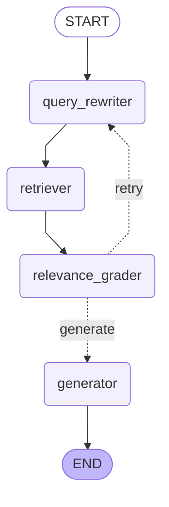

# DocsRAG

Self-hosted RAG (Retrieval-Augmented Generation) system for technical documentation Q&A.

**Status:** 🚧 In active development — Task 7 complete, Task 8 (vLLM) next.

## Goals

A production-grade RAG system demonstrating modern MLOps practices:
- End-to-end RAG pipeline with hybrid retrieval and reranking
- Agentic workflow via LangGraph (query rewriting, relevance grading)
- Quality evaluation with Ragas, experiment tracking with MLflow
- Full observability: LLM tracing (LangFuse) + system metrics (Prometheus/Grafana)
- Multi-backend inference: Ollama for development, vLLM for production

## Tech Stack

| Layer | Technology |
|---|---|
| API | FastAPI + Pydantic |
| LLM | Qwen 2.5 7B Instruct via Ollama |
| Embeddings | BAAI/bge-small-en-v1.5 (384-dim, MPS on Apple Silicon) |
| Vector DB | Qdrant (cosine similarity) |
| Orchestration | LangChain |
| Retrieval | Dense (Qdrant) + Sparse (BM25) + Cross-encoder reranker |
| Evaluation | Ragas + MLflow |
| Observability | LangFuse, Prometheus, Grafana *(Task 7)* |
| Prod inference | vLLM *(Task 8)* |
| Packaging | Docker Compose, uv |

## Quick Start

**Prerequisites:** Docker Desktop, Python 3.12, [Ollama](https://ollama.com) (native on macOS).

```bash
# 1. Pull the LLM model into Ollama
ollama pull qwen2.5:7b-instruct-q4_K_M

# 2. Install Python dependencies
make install

# 3. Fetch FastAPI docs and index into Qdrant (one-time, ~2 min)
make fetch-docs
make up
uv run python -m indexing.run_indexing --recreate --chunk-size 1024 --overlap 100

# 4. Warm up and query
make warmup
make ask Q='How do I define a path parameter in FastAPI?'
```

## API

The RAG API runs on `http://localhost:8000`.

### `GET /health`

```bash
make health
```

Returns Qdrant collection status, point count, and configured model names.

### `POST /ask`

```bash
make ask Q='How does dependency injection work in FastAPI?'
```

Parameters:

| Field | Type | Default | Description |
|---|---|---|---|
| `question` | string | — | Natural language question |
| `top_k` | int | 5 | Number of chunks to retrieve |
| `include_contexts` | bool | false | Include raw chunk text in response |

Response includes `answer`, `sources` (with `source_path`, `header_path`, `score`), and timing breakdown (`retrieval_ms`, `generation_ms`, `total_ms`).

## Evaluation

Evaluation uses [Ragas](https://docs.ragas.io) metrics over a 25-question golden dataset derived from FastAPI documentation. Results are tracked in MLflow (`http://localhost:5000`).

```bash
make eval CONFIG=configs/chunk_1024.yaml   # run evaluation (dense baseline)
make mlflow-ui                             # open MLflow UI
```

### Task 4 sweep — chunk size and top-k (dense retrieval)

| Config | chunk\_size | overlap | top\_k | faithfulness | answer\_relevancy | context\_precision | context\_recall |
|---|---|---|---|---|---|---|---|
| chunk\_256 | 256 | 25 | 5 | 0.646 | 0.767 | 0.417 | 0.353 |
| baseline | 512 | 50 | 5 | 0.757 | 0.849 | 0.506 | 0.431 |
| topk\_3 | 512 | 50 | 3 | 0.719 | 0.775 | 0.517 | 0.403 |
| topk\_10 | 512 | 50 | 10 | 0.818 | **0.892** | 0.526 | 0.517 |
| **chunk\_1024** ✓ | **1024** | **100** | **5** | **0.882** | 0.886 | **0.598** | **0.557** |

### Task 5 — hybrid search and reranking (chunk\_size=1024, top\_k=5)

| Strategy | faithfulness | answer\_relevancy | context\_precision | context\_recall |
|---|---|---|---|---|
| **dense** ✓ | **0.882** | 0.886 | **0.598** | **0.557** |
| hybrid (dense + BM25 → RRF) | 0.789 | 0.818 | 0.556 | 0.523 |
| hybrid\_rerank (+ cross-encoder) | 0.825 | **0.890** | 0.566 | 0.510 |

**Finding:** dense retrieval outperforms both hybrid variants on this dataset. BM25 adds keyword-match noise to semantically rich technical documentation where the dense embeddings already perform well. The cross-encoder partially recovers `answer_relevancy` and `context_precision` but cannot fully offset the RRF noise. Dense remains the production strategy.

### Task 6 — agentic RAG (chunk\_size=1024, top\_k=5, dense retrieval)

| Strategy | faithfulness | answer\_relevancy | context\_precision | context\_recall |
|---|---|---|---|---|
| dense (baseline) | **0.882** | 0.886 | 0.598 | **0.557** |
| agentic | 0.817 | 0.813 | **0.653** | 0.450 |

**Finding:** agentic grading improves `context_precision` (+0.055) by filtering irrelevant chunks before generation, but at the cost of `context_recall` (−0.107): the binary relevance grader discards borderline-relevant chunks. `faithfulness` and `answer_relevancy` drop slightly because graded-out context sometimes contained answers. Dense remains the better end-to-end strategy; the agentic pipeline is useful when precision matters more than recall.

## Agentic RAG Graph

The `/agent/ask` endpoint runs questions through a LangGraph agent that rewrites the query, grades retrieved chunks for relevance, and retries retrieval if necessary.



**Nodes:**
- `query_rewriter` — LLM rewrites the question to improve retrieval; on retry uses different phrasing
- `retriever` — dense vector search via Qdrant
- `relevance_grader` — LLM scores each chunk as relevant/not relevant (JSON verdict)
- `generator` — generates the final answer from relevant chunks only

**Retry logic:** if fewer than 2 chunks pass grading and no retry has been attempted, the graph loops back to `query_rewriter`. Maximum 1 retry.

## Task 8 — vLLM backend + benchmark (Apple Silicon, M4 Max)

Inference backend is switchable via `INFERENCE_BACKEND=ollama|vllm` in `.env`.  
With `vllm`, the API uses `ChatOpenAI` pointing at a [vllm-metal](https://github.com/vllm-project/vllm-metal) endpoint (OpenAI-compatible, same API as production vLLM on CUDA).

**Benchmark — generation latency, 5 warm questions, top\_k=3:**

| Backend | avg gen | p50 gen | min | max |
|---|---|---|---|---|
| Ollama (Qwen2.5-7B q4\_K\_M, llama.cpp) | 3375ms | 3439ms | 2064ms | 4327ms |
| **vllm-metal (Qwen2.5-7B 4bit, MLX)** | **891ms** | **911ms** | **705ms** | **1075ms** |

**Finding:** vllm-metal is **3.8× faster** on generation latency vs Ollama on M4 Max. MLX uses Apple Silicon unified memory more efficiently than llama.cpp. On a CUDA GPU, the same code (with `vllm/vllm-openai` image) would provide similar or greater speedup.

To reproduce:
```bash
# Start vllm-metal
vllm-metal --model mlx-community/Qwen2.5-7B-Instruct-4bit --host 127.0.0.1 --port 8001

# Run benchmark (Ollama must also be running)
uv run python benchmarks/bench_backends.py
```

## Project Structure

```
docsrag/
├── api/              # FastAPI service
│   ├── main.py       # /health, /ask, /agent/ask endpoints + Prometheus instrumentation
│   ├── rag.py        # RAGPipeline: embed → retrieve → generate
│   ├── retriever.py  # HybridRetriever: BM25Index + RRF + CrossEncoder (Task 5)
│   ├── graph.py      # Agentic RAG graph via LangGraph (Task 6)
│   ├── llm.py        # LLM factory: ChatOllama or ChatOpenAI→vLLM (Task 8)
│   ├── metrics.py    # Prometheus custom metrics (Task 7)
│   ├── tracing.py    # LangFuse callback helper (Task 7)
│   ├── prompts.py    # System + user prompt templates
│   ├── schemas.py    # Pydantic request/response models
│   └── config.py     # Pydantic Settings
├── indexing/         # Indexing pipeline (Task 2)
│   ├── loader.py     # Markdown loader
│   ├── chunker.py    # Hierarchical chunker (header + recursive)
│   ├── embeddings.py # EmbeddingModel (sentence-transformers)
│   └── qdrant_store.py
├── evaluation/       # Evaluation framework (Task 4)
│   ├── golden_dataset.json  # 25 hand-verified Q&A pairs
│   └── run_eval.py          # Ragas + MLflow eval harness
├── configs/          # Experiment configs (YAML)
│   ├── baseline.yaml
│   ├── chunk_256.yaml
│   ├── chunk_1024.yaml      # dense baseline (frozen)
│   ├── hybrid.yaml          # dense + BM25 → RRF
│   ├── hybrid_rerank.yaml   # dense + BM25 → RRF + cross-encoder
│   ├── topk_3.yaml
│   └── topk_10.yaml
├── observability/    # Task 7 — Prometheus, Grafana, LangFuse
├── benchmarks/       # Task 8 — vLLM benchmarks
├── tests/
├── docker-compose.yml
└── Makefile
```

## Current State

- **Qdrant collection:** `docsrag`, 2540 chunks, chunk\_size=1024, overlap=100
- **Retrieval strategy:** dense vector search (best by eval); hybrid and hybrid\_rerank available via config
- **Generation:** `temperature=0.0` for determinism; answers cite sources as `[file.md]`
- **Inference backend:** `INFERENCE_BACKEND=ollama` (default) or `vllm` — switchable via `.env`
- **Observability:** LangFuse tracing, Prometheus `/metrics`, Grafana dashboard at `:3000`

## Makefile Reference

```bash
make up            # Start Qdrant + API + MLflow (Ollama must be running natively)
make down          # Stop services
make build         # Build API Docker image
make health        # GET /health
make ask Q="..."   # POST /ask
make warmup        # Load LLM into Ollama RAM (run after make up)
make reindex                                      # Recreate with defaults (chunk_size=1024, overlap=100)
make reindex CHUNK_SIZE=512 CHUNK_OVERLAP=50      # Override chunk params
make smoke         # Retrieval sanity check
make eval          # Run evaluation (CONFIG=configs/baseline.yaml by default)
make mlflow-ui     # Open MLflow UI in browser
make prometheus-ui # Open Prometheus UI (http://localhost:9090)
make grafana-ui    # Open Grafana dashboard (http://localhost:3000, admin/admin)
make lint          # ruff
make format        # ruff --fix + black
make type-check    # mypy
make test          # pytest
```

## Roadmap

- [x] Task 1: Infrastructure setup
- [x] Task 2: Indexing pipeline (2540 chunks at chunk\_size=1024, smoke tests passing)
- [x] Task 3: Basic RAG API (FastAPI + LangChain + Ollama, verified end-to-end)
- [x] Task 4: Evaluation framework (Ragas + MLflow, 5 configs swept, baseline frozen)
- [x] Task 5: Hybrid search + reranker (BM25 + RRF + cross-encoder; dense remains best)
- [x] Task 6: Agentic RAG with LangGraph (query rewriting + relevance grading; precision↑ recall↓)
- [x] Task 7: Observability (LangFuse tracing + Prometheus metrics + Grafana dashboard)
- [x] Task 8: vLLM backend (vllm-metal on Apple Silicon) + benchmark (3.8× faster than Ollama)
