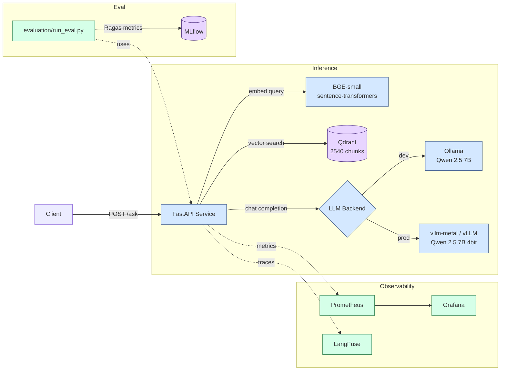

## System Architecture

The API is the only stateful service. Qdrant holds chunk embeddings; MLflow holds eval runs. Ollama / vLLM are stateless inference servers swapped via `INFERENCE_BACKEND` env var. Observability is fully additive — the system runs unchanged without LangFuse keys or with Prometheus disabled.